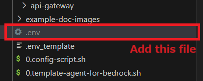
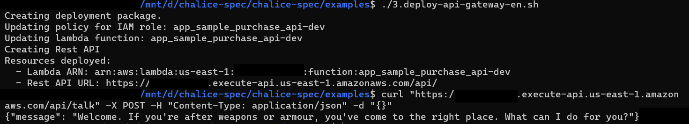
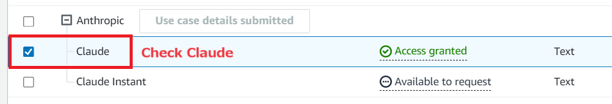
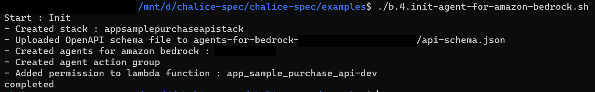
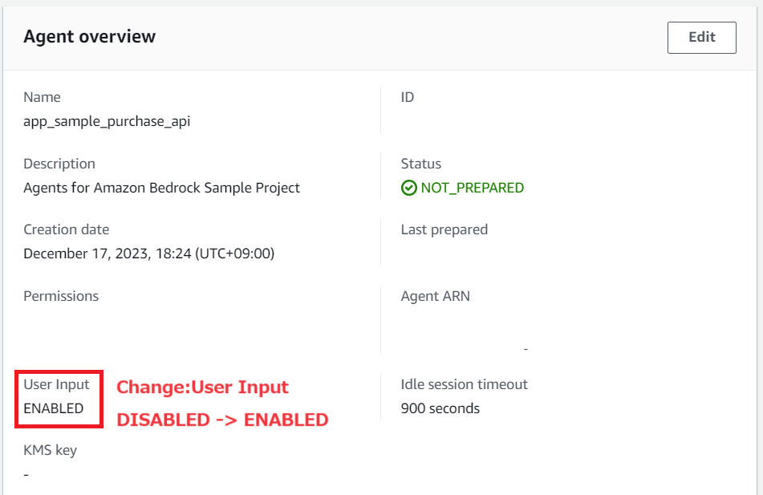
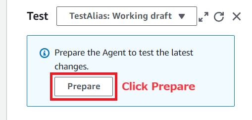
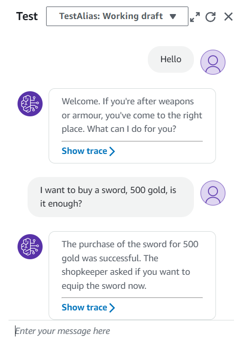

# Chalice-spec project sample

Sample project for chalice-spec.  
This document is about,

- Run chalice on `localhost`
- Run chalice on `APIGateway`
- Run chalice on `Agents for Amazon Bedrock`

## Setup

1. Create `.env` file in this directory, and set AWS credentials.  
   -> format: copy from `.env_template`



2. Execute setup-script, build docker image.

```bash
./1.build-script.sh
```

## Execute local

Execute script, start local server.

```bash
./2.run-local-api-apigateway-en.sh
```

You can call to get with curl command from host.

```bash
curl http://localhost:8000/talk -X POST -H "Content-Type: application/json" -d "{}"
```

## Deploy with API Gateway

Create AWS Resources, and deploy chalice.

```bash
./3.deploy-api-gateway-en.sh
```

You can execute api with HTTPS.

```bash
curl "https://XXXXXXXXXXXX.execute-api.aws-region.amazonaws.com/api/talk" -X POST -H "Content-Type: application/json" -d "{}"
```



## Deploy with Agents for Amazon Bedrock

Setup:

- Enable bedrock `model access` in us-east-1 (Anthropic Claude).



Create AWS Resources, and deploy chalice.

```bash
./b.3.deploy-agent-for-amazon-bedrock.sh
```

Setting amazon bedrock for chalice.

```bash
./b.4.init-agent-for-amazon-bedrock.sh
```



Open AWS Management Console Bedrock, and Change `User Input` to ENABLED,



Click `Prepare` in Agents console.



You can execute api with generative AI.



e.g. Talking sample.

- Hello
- I want to buy a sword, 500 gold, is it enough?
- I want to sell a MURAMASA, ok?

## Update

If you want to update prompt with OpenAPI.

```bash
./b.5.sync-agent-for-amazon-bedrock.sh
```

## Clean

```bash
## When created with "Deploy with API Gateway"
./9.delete-api-gateway-en.sh
## When created with "Deploy with Agents for Amazon Bedrock"
./b.9.delete-agent-for-amazon-bedrock.sh
```
